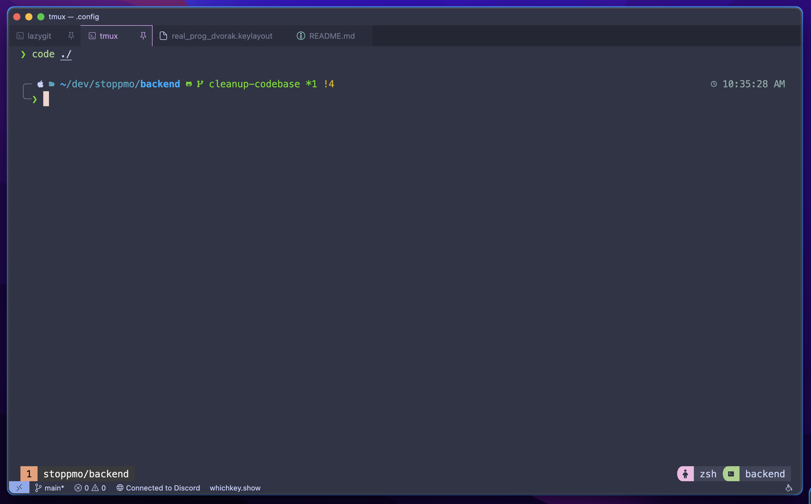
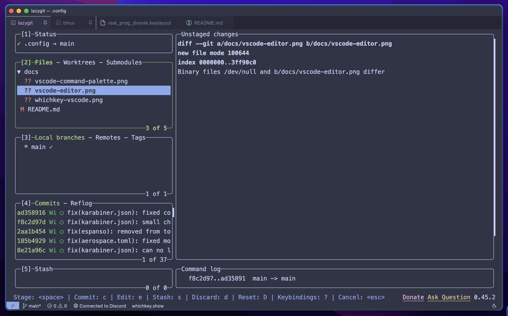
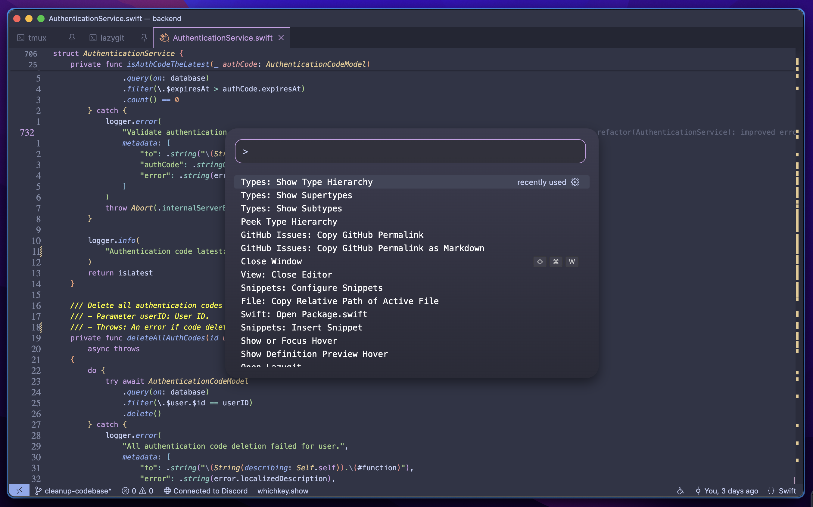
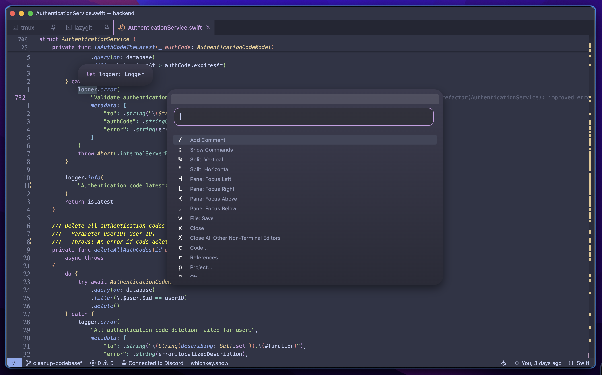
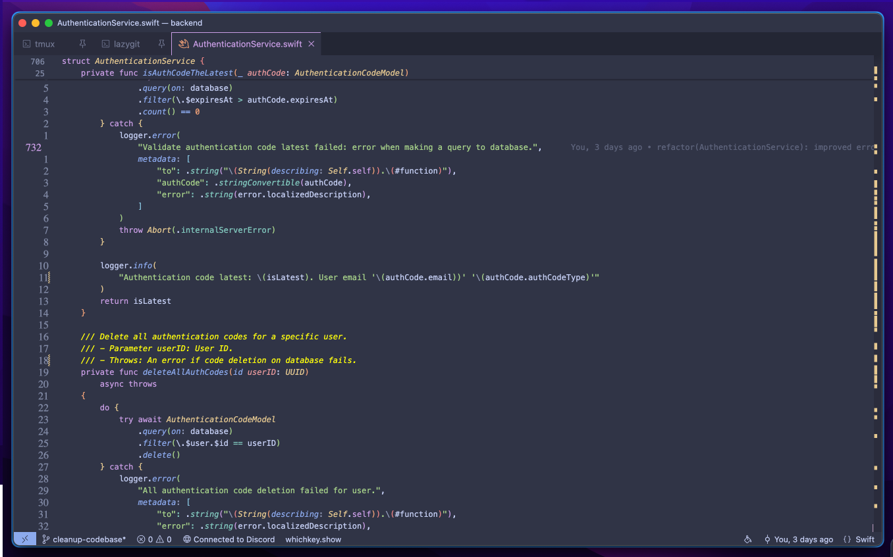
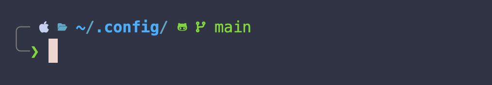
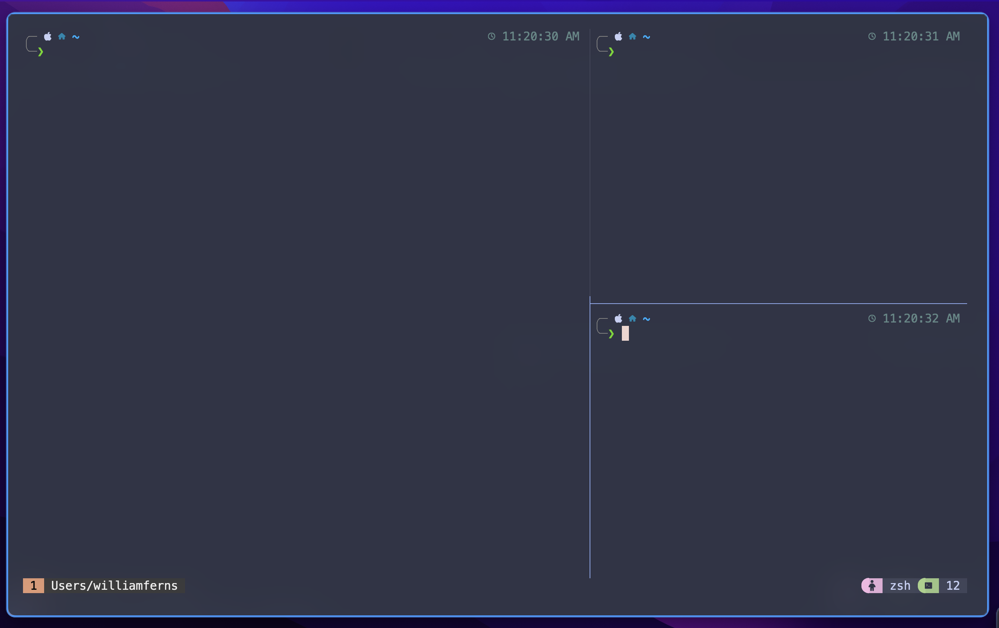
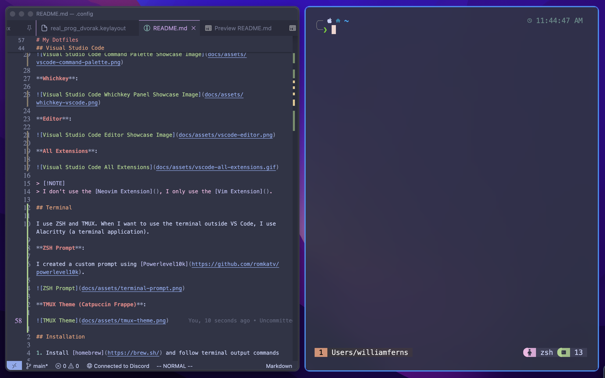

# My Dotfiles

Welcome to my dotfiles! Here are all the configurations for tools I use to be more productive. This includes, but aren't limited to:
- [Aerospace]() - tiling window manager for OSX, similar to i3wm.
- [TMUX]() - terminal multiplexer.
- [ZSH]() - terminal shell built-in for OSX.
- [Visual Studio Code]() - the most popular IDE for software development.
- [Espanso]() - helpful shorthand snippets I use for sharing social links, searching, etc.
- [Karabiner Elements]() - remap/customize input devices like your mouse and keyboard (I even created multiple keyboard layouts using this).

> [!NOTE]
> I use OSX, meaning some of these dotfiles are for Darwin only. You can still use most of my configs on most Linux distrobutions. Since I use Homebrew for the setup script, it might not fully work on Linux since they have their own package managers.

## Visual Studio Code

My VSCode setup has a really minimalistic Neovim style look. It utilizes [Whichkey]() extension to have the same style mappings as Neovim. I have TMUX and Lazygit directly inside my IDE, using [this extension]() for Lazygit and [my own extension] for TMUX.

I followed [this video](https://www.youtube.com/watch?v=9_I0bySQoCs&ab_channel=GlennRaya) to inject custom JavaScript and CSS into Visual Studio Code to create the custom command panel, the minimalistic look, etc.

**Theme**: Catppuccin (Frappe). [View Extension](https://github.com/catppuccin/vscode)

**TMUX and Lazygit in VSCode**:




**Command Palette**:



**Whichkey**:



**Editor**:



**All Extensions**:


> [!NOTE]
> I don't use the [Neovim Extension](), I only use the [Vim Extension]().

## Terminal

I use ZSH and TMUX. When I want to use the terminal outside VS Code, I use Alacritty (a terminal application).

**ZSH Prompt**:

I created a custom prompt using [Powerlevel10k](https://github.com/romkatv/powerlevel10k).



**TMUX Theme (Catpuccin Frappe)**:



## Other

**Active Application Border**:

When I have multiple applications side-by-side, it can be hard to know which one I am focused on. That is why I added a border around the currently focused application.



**Tiling Window Manager**:


## Installation

1. Install [homebrew](https://brew.sh/) and follow terminal output commands

2. Install Alacritty
```bash
brew install --cask alacritty
```
Go to security settings and allow to open Alicritty. If confused, watch [this section](https://www.youtube.com/watch?v=uOnL4fEnldA&t=29s)

3. Install git
```bash
brew install git
```

4. Install tmux
```bash
brew install tmux
```

5. Install nerd font
```bash
brew install font-meslo-lg-nerd-font
```
7. Install oh my zsh
```bash
bash -c "$(curl -fsSL https://raw.githubusercontent.com/ohmyzsh/ohmyzsh/master/tools/install.sh)"
```

8. Install p10k
```bash
git clone --depth=1 https://github.com/romkatv/powerlevel10k.git ${ZSH_CUSTOM:-$HOME/.oh-my-zsh/custom}/themes/powerlevel10k
```

9. Install TPM (tmux plugins manager)
```bash
git clone https://github.com/tmux-plugins/tpm ~/.tmux/plugins/tpm
```

10. Install all tmux plugins by pressing `<ctr> + <space> + <shift> + i`

11. Install github cli:
```bash
brew install gh
```

12. Install commitizen:
```bash
brew install commitizen
```

13. Install zshell autosuggestions:
```bash
brew install zsh-autosuggestions
echo "source $(brew --prefix)/share/zsh-autosuggestions/zsh-autosuggestions.zsh" >> ~/.zshrc
```

14. Setup zshell syntax highlighting:
```bash
brew install zsh-syntax-highlighting
echo "source $(brew --prefix)/share/zsh-syntax-highlighting/zsh-syntax-highlighting.zsh" >> ~/.zshrc
```

15. Setup a better 'ls' command
```bash
brew install eza
```

16. Setup a better 'cd' command
```bash
brew install zoxide
```

16. Install newest version of bash
```bash
brew install bash
```

17. Install raycast
```bash
brew install --cask raycast
```

18. Small Accessibility changes
- The start of this video talks about some system settings configuration. [Reference Video](https://www.youtube.com/watch?v=k94qImbFKWE)
- Use as reference - [Brothers Dotfiles](https://github.com/AdonisCodes/dotfiles)

19. Install yabai
Use the same reference video outlined above as a guideline. Can use [this blog post](https://www.josean.com/posts/yabai-setup) as well.
```bash
brew install koekeishiya/formulae/yabai
brew install koekeishiya/formulae/skhd
```
Start yabai service
```bash
yabai --start-service
```

Start skhd service
```bash
skhd --start-service
```

20. Install espanso
```bash
brew install espanso
```

21. Install sketchybar
```bash
brew tap FelixKratz/formulae
brew install sketchybar
```

22. Install better touch tool
```bash
brew install --cask bettertouchtool
```

23. Install borders
```bash
brew tap FelixKratz/formulae
brew install borders
```

24. Move keyboard layout to correct location. This is for mac os:

```bash
sudo cp ./prog_dvorak.keylayout /Library/Keyboard\ Layouts
```

25. Install auto-completion plugin:
```bash
 brew install zsh-autocomplete
```
